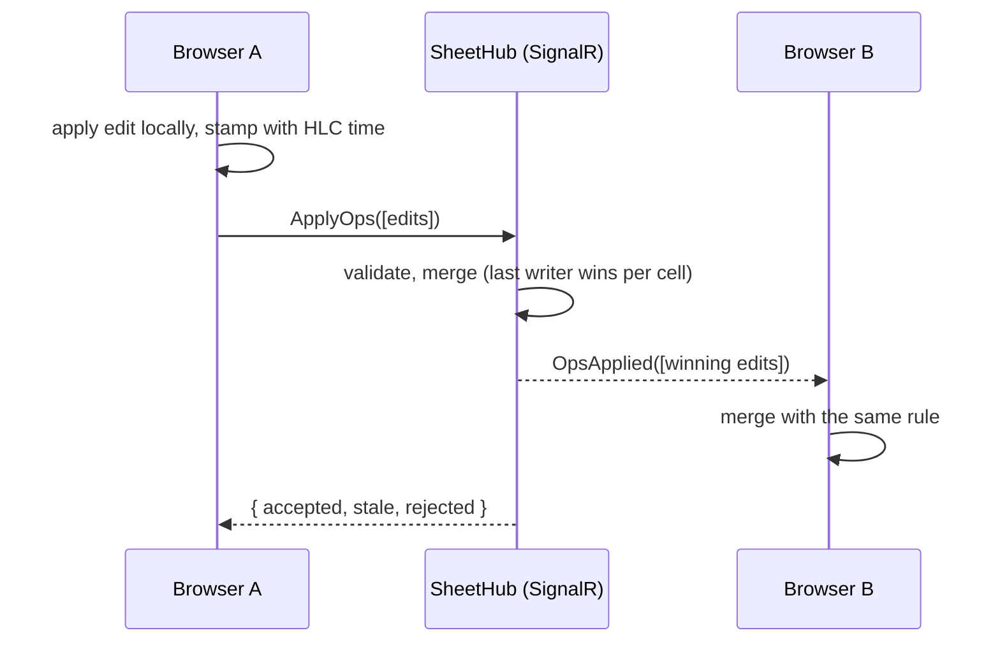
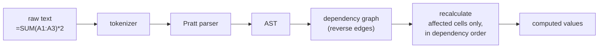
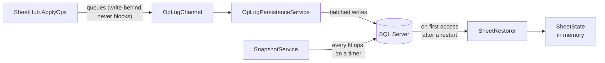

# GridSync

[](https://github.com/KrishPatel10/GridSync/actions/workflows/ci.yml)

A spreadsheet where several people can edit the same sheet at once, one of them can drop offline, and when they reconnect every screen ends up identical, without a central lock or a server deciding who wins.

**Stack:** ASP.NET Core 10 and SignalR on the server, Angular 22 (standalone, zoneless, signals) in the browser.

Phases 1 and 2 of 4 are done, and phase 3 is most of the way there: a live-synced, virtualized grid with presence and offline edit merging, a formula engine that runs in a Web Worker, durable offline edits, and server-side persistence with SQL Server. Concurrent row insertion is what's left of phase 3 (see [Roadmap](#roadmap)).

## Run it

You need the .NET 10 SDK, Node.js 22.22.3+ or 24.15+, and Docker (for persistence; the app also runs without it, see below).

```bash
# once, and again any time you want to start clean: a local SQL Server for persistence
docker compose up -d

# terminal 1: the sync server on http://localhost:5080
cd server
dotnet run --project src/GridSync.Api

# terminal 2: the Angular app on http://localhost:4200 (proxies /hubs and /api to the server)
cd client
npm install
npm start
```

Open http://localhost:4200 in two browser windows side by side. Use `?sheet=anything` in the address bar to open a different sheet.

The server's Development config (`appsettings.Development.json`, used automatically by `dotnet run`) points at the SQL Server `docker compose up` starts, so persistence is on by default for local development. Without Docker, clear that connection string first (an empty `ConnectionStrings:GridSync`, e.g. `dotnet run --project src/GridSync.Api -- --ConnectionStrings:GridSync=`), and the server falls back to in-memory state, same as phase 1. A connection string that is *set but unreachable* (Docker not started) is a hard startup error on purpose: see [Persistence](#persistence).

## Try this

1. Type in one window. The other window shows the edit a moment later, flashing in the author's color, with their cursor and name tag on the cell.
2. Paste a block of cells copied from Excel or Google Sheets. It arrives in the other window as one batch.
3. Press **Go offline** in window A. Edit a few cells in both windows, including the same cell in both. The status bar in A counts the edits waiting to sync.
4. Press **Go online**. A's queued edits reach B, B's edits reach A (and flash so you can see what changed while you were away), and the cell you edited in both windows shows the same value everywhere.
5. Press Ctrl+End. You're on row 100,000, and the page still only has about 30 rows in it.
6. Type `10` in A1 and `=A1*2` in B1. B1 shows `20`, and the formula bar shows the formula. Change A1 in the *other* window and watch B1 follow in both. Then type `=B1` in A1 to make a loop: both cells show `#CYCLE!`, and go back to normal when you break it.
7. Press **Go offline**, type something, then close the tab entirely (not just Go online first). Reopen `http://localhost:4200` with the same `?sheet=` a little later: the edit is there, and it syncs on its own once the page is live.
8. With `docker compose up -d` running, type in a cell, wait a couple of seconds, then stop the server (Ctrl+C in its terminal) and start it again. Reload the browser: the cell is still there. The server never remembered it in memory across that restart; SQL Server did.
9. Drag across cells, or click one and press Shift plus an arrow key, to select a block. The address box shows it as `B2:D5`, Delete clears the whole block, Ctrl+C copies it as tab-separated text, and pasting drops the same shape at the block's top-left corner. Ctrl+A selects everything and Escape collapses back to one cell. Other people still see only your active cell, not your block.

## How it works



Every cell is a last-writer-wins register. Every edit carries a hybrid logical clock (HLC) timestamp, and the edit with the greater timestamp wins. That merge rule is commutative, associative, and idempotent, so any two replicas that have seen the same edits end up identical, no matter what order the edits arrived in or how many times they were delivered. The server, every browser, and the tests all use the same rule.

### Design decisions worth asking about

**Why a hybrid logical clock instead of wall-clock time?** If my laptop clock runs two minutes slow and I overwrite your edit after seeing it, wall-clock time says my edit is older and yours wins, which is the opposite of what I meant. An HLC folds in every timestamp it receives, so an edit made after seeing another edit always sorts after it, while staying close to real time. See `HybridLogicalClock.cs` and `hlc.ts` (same algorithm, same tie-break order).

**Why keep cleared cells as tombstones?** If clearing a cell deleted its entry, an offline replica still holding the old value would bring it back when it reconnects. A clear is stored as an edit whose value is null, and it wins or loses like any other edit.

**Why are retries safe?** Merges are idempotent: applying an edit twice changes nothing. So the client keeps unsent edits in a queue, resends them after a reconnect, and never needs to know whether a batch "half landed". The queue also coalesces: ten edits to the same cell while offline become one. And if you edit a cell again while its previous edit is in flight, the in-flight acknowledgment doesn't remove the newer edit (`pending.get(key) === op` in `sheet-sync.service.ts`).

**Why join the group before taking the snapshot?** A new client is added to the sheet's SignalR group first, then handed the snapshot. An edit landing in between may arrive twice (in the snapshot and as a broadcast), which is harmless. Doing it the other way round could lose it.

**Why is the server's merge lock-free?** `SheetState.Apply` uses a compare-and-swap loop on a `ConcurrentDictionary`: read the current value, decide, then `TryUpdate` only if nobody changed it in the meantime. Many hub calls can merge edits into the same sheet concurrently without a sheet-wide lock. A test hammers one cell from parallel threads to check the greatest timestamp always ends up in place.

**What does the server refuse to trust?** Clients can't stamp edits with timestamps more than 60 seconds in the future (otherwise a clock set to 2099 wins every conflict forever), can't use another replica's node id (which would let them win tie-breaks or disguise authorship), and are limited in batch size, value length, and number of sheets.

**Why a hand-written virtual scroller?** Only the rows on screen exist in the DOM. With fixed row heights, the visible range is pure arithmetic (`floor(scrollTop / rowHeight)`), the canvas height gives the scrollbar its true size, and one `translateY` slides the rendered window into place. Writing it by hand keeps the column headers and row numbers sticky on both axes and leaves room for column virtualization later.

## Formulas

A cell whose text starts with `=` is a formula. Only the raw text is synced, so the sync protocol and the merge rule did not change. Each browser computes the values itself, and because the evaluator is deterministic and every replica has the same text, every replica ends up with the same values. No computed value ever crosses the network.

| You can write | Examples |
|---|---|
| Numbers, text in double quotes | `=42`, `="hello"`, `="say ""hi"""` |
| Cell and range references | `=A1`, `=SUM(A1:B10)` |
| Arithmetic, joining, comparing | `=A1*2+1`, `=A1&" units"`, `=A1>=10`, `=-A1^2` |
| `SUM AVERAGE MIN MAX COUNT IF ROUND` | `=IF(A1>0,"up","down")`, `=ROUND(A1/3,2)` |

Errors are values: `#DIV/0!`, `#VALUE!`, `#REF!` (outside the sheet), `#NAME?` (unknown name or function), `#NUM!` (not a finite number), `#ERROR!` (text that does not parse), and `#CYCLE!`. Precedence follows Excel, including the quirks: `-2^2` is 4 and `2^3^2` is 64.

### How the engine works



**Parsing.** A hand-written tokenizer feeds a Pratt (precedence-climbing) parser: each operator has a binding power, and one loop absorbs operators for as long as they bind tighter than the caller. That gives correct precedence with no grammar tables, and left-associative chains like `1+1+1+...` run in a loop instead of recursing.

**Incremental recalculation.** When a cell changes, the calculator follows reverse edges ("who reads this cell?") to find everything downstream, and recomputes only those cells, each once, in dependency order (Kahn's algorithm). Ranges like `A1:A100000` are kept as rectangles, filed under the columns they span, instead of becoming 100,000 edges.

**Cycles.** Cells still waiting after Kahn's algorithm has finished are stuck on each other. A formula is `#CYCLE!` if it is on a loop or reads one, decided from what it *could* read (even inside an `IF` branch that will not run), so every replica agrees. Two people can create a loop without either of them ever seeing one: Alice sets `A1` to `=B1` while offline, Bob sets `B1` to `=A1`. Neither edit is a loop alone, so cycles are detected when computing, on every replica, not by rejecting edits. Nothing here recurses per cell, so a 100,000 cell loop or chain is fine.

**Two engines, one spec.** The evaluator and calculator exist in C# (`GridSync.Core.Formulas`) and TypeScript (`client/src/app/formulas`). The same JSON files drive both test suites: `spec/formula-vectors.json` (evaluation) and `spec/recalc-vectors.json` (edit sequences, including how many formulas each edit evaluates). The server does not need to compute anything for sync to work; the C# engine is the reference implementation that keeps the TypeScript one honest. It has already paid for itself: a shared vector showed that .NET breaks an exact tie when formatting 15 digits toward the even digit while JavaScript and Excel round away from zero, so the two engines would have printed different text for `=1000000000000005`.

**Off the UI thread.** In the browser the calculator runs in a Web Worker. The page sends raw cell changes, and the worker replies with the display text of only the formulas that changed. A formula shows blank for the moment the worker takes to answer, and everything that is not a formula appears at once. If the worker cannot start or fails, the page recomputes everything itself from the raw cells it already holds. Adding `?formulas=inline` to the address forces that in-page mode, for comparing the two.

## Offline durability

Closing the tab while offline, with edits that never reached the server, used to lose them. Now every unsent edit is also written to IndexedDB, so reopening the sheet recovers them: type while offline, close the tab, come back later, and the edits are there, syncing as soon as the connection is live again.

Recovery does not try to reuse the closed tab's identity. Reusing its node id would risk two tabs racing to adopt the same one, and the hub binds every op to the node id its connection joined with, so a collision would make one tab's edits look forged by another. Instead, a recovered edit is replayed as a brand-new local edit under the reopened tab's own identity: same cell, same value, a fresh timestamp. The exact old timestamp never mattered for correctness, only that the cell ends up holding what was typed.

A record is only recovered once it looks abandoned: each tab refreshes a "last seen" timestamp on its own IndexedDB record every few seconds while it holds unsent edits, and another tab only adopts a record once that timestamp is stale (currently 12 seconds). This is a heuristic, not a guarantee: a tab throttled hard enough by the browser (deeply backgrounded, for instance) could in theory look abandoned while still alive. That's not data-corrupting, since the last-writer-wins merge handles a duplicate resend safely either way, just a rare duplicate effort. If IndexedDB isn't available at all (some private-browsing modes, a sandboxed iframe), the app falls back to phase 1's in-memory-only behaviour and says so honestly: the "you'll lose unsaved edits" warning on closing the tab only appears when that fallback is actually in use.

## Persistence

Server state used to live only in memory: a restart lost every sheet. Now every accepted edit is written to an append-only log (SQL Server, via EF Core), and a restart restores each sheet from that log instead of starting it empty.



**Write-behind, not write-through.** `ApplyOps` queues an accepted edit onto an in-memory channel and returns immediately; a background service drains that channel and writes to the database in batches, so no edit waits on a database round trip. This is a real trade-off, not a free one: if the process crashes in the narrow window between accepting an edit and the next flush, that edit is lost from the log even though the client was told it won. A synchronous write per edit would close that window at the cost of every edit waiting on the database. The queue is unbounded and flushes are frequent, which keeps the window small; it does not make it zero, and the code says so where it matters (`OpLogChannel.cs`).

**Snapshots, so a restart doesn't replay everything.** A background service periodically checks every loaded sheet and, once it has accumulated enough new log entries (200 by default) since its last snapshot, writes a fresh one: the sheet's full state as of that point in the log. Restoring a sheet loads its snapshot, then replays only the log entries after it, through the exact same merge (`SheetState.Apply`) live edits use. That reuse is what makes restore trivially correct: a tail entry that turns out to be older than what the snapshot already holds (a slightly-behind client's clock, logged after the snapshot was taken) is simply ignored, the same as it would be live, and replaying something the snapshot already reflects is a no-op, because the merge is idempotent. Restore never needs its own special-cased logic for "which value wins."

**Restore is lazy, per sheet.** Rather than loading every persisted sheet when the process starts, a sheet is restored the first time something asks for it after a restart (the same `GetOrCreateAsync` that used to just create an empty one). This still satisfies "a restart loses no acknowledged edit": the data was never at risk, only when it's read back, and it avoids paying for sheets nobody reopens.

**Without a database, the server still runs.** No `ConnectionStrings:GridSync` configured means an in-memory store instead, identical in behaviour to phase 1: works, but a restart resets everything. A connection string that *is* set but unreachable is a different case and a hard failure at startup: that's a real misconfiguration (wrong password, container not started), not an opt-out.

**Changing the schema.** `OpLogEntry` and `SheetSnapshot` (`server/src/GridSync.Api/Persistence/`) are the whole model. After changing either, generate a new migration from `server/src/GridSync.Api`: `dotnet ef migrations add <Name> --output-dir Persistence/Migrations`. It runs against a design-time-only context (`GridSyncDbContextFactory.cs`), never a real database.

**Verifying this without a reachable image registry.** The sandbox this was built in cannot pull `mcr.microsoft.com/mssql/server` (Docker itself works; that one registry is unreachable from it), so the SQL-Server-specific path could not be run live from here. Everything this project's own code is responsible for was still proven, twice: `GridSync.Api.Tests` runs the real `Program.cs`, the real `EfPersistenceStore`, and real EF Core migrations against SQLite instead (a provider swap, which is EF Core's concern, not this project's), including a test that disposes the app and creates a fresh one against the same database file and confirms every edit is still there. Separately, the real server was run as a real OS process, with a real SQLite file, edited through a real browser, killed outright, and restarted as a genuinely new process: the edit was there, restored, before any client resent it. What was *not* verified here is the SQL Server dialect itself; run `docker compose up -d` yourself to confirm that last piece.

## Tests

```bash
cd server && dotnet test         # 489 tests across two projects:
                                 # GridSync.Core.Tests (455): HLC ordering, LWW merge, tombstones,
                                 #   validation, a seeded convergence test, a parallel-writers test for
                                 #   the lock-free merge, and the formula engine (parser, evaluator,
                                 #   calculator, cycles, 100,000 cell chains, a property test)
                                 # GridSync.Api.Tests (34): the persistence layer against an in-memory
                                 #   fake (restore logic, write-behind batching, snapshot timing), and
                                 #   against a real WebApplicationFactory<Program> + SQLite + a real
                                 #   SignalR client, including a full restart-recovers-everything test
cd client && npm test            # 512 tests: the same on the TypeScript side, plus the sync service
                                 # and the offline outbox (IndexedDB durability)
cd client && npm run smoke       # 14 end-to-end checks with real SignalR clients against a running server
```

`npm run smoke` needs the server running. Set `GRIDSYNC_URL=http://localhost:4200 GRIDSYNC_WS_ONLY=1` to run it through the Angular dev proxy over WebSockets only.

If the server is running, `dotnet test` on the whole solution can fail with a file-lock error, because the running server holds its own copy of `GridSync.Core.dll`. Run `dotnet test tests/GridSync.Core.Tests` instead, or stop the server first.

## Numbers

Every number here comes from a command you can run. Hardware: AMD Ryzen 7 5800H (8 cores, 16 threads), 63 GB RAM, Windows 11, Node 22.21.1, Vitest 4 on jsdom.

```bash
cd client && npm run bench:formulas
```

This times the calculator alone (parse, dependency lookup, ordering, evaluation, building the update list) on one thread, with no rendering and no worker. Each figure is the median of 15 runs after 3 warmups. The range is the lowest and highest of those medians across 4 separate runs of the command. The machine was also running a browser and dev servers, and the fourth run was the slowest, so treat the upper end as "on a busy laptop".

| One edit that... | Formulas recomputed | Median time |
|---|---|---|
| is read by 10,000 formulas | 10,000 | 15 to 18 ms |
| is read by 100,000 formulas | 100,000 | 190 to 250 ms |
| starts a chain of 10,000 dependent formulas | 9,999 | 15 to 19 ms |
| is inside a 10-cell range that 10,000 formulas each sum | 10,000 | 15 to 21 ms |
| is inside a 10,000-cell range that 1 formula sums | 1 | 0.2 to 0.3 ms |
| *Loading 10,000 new formulas in one batch (a join snapshot)* | 10,000 | 24 to 37 ms |

For scale: one frame at 60 Hz is 16.7 ms, so recalculating 10,000 dependents on the page's own thread costs about a frame, and 100,000 would freeze the page for 0.2 s or more. That is why formulas run in a worker. A manual check in the browser (not a repeatable command) agreed: with the worker, the edit handler stayed at a few milliseconds even with 100,000 dependents, where the in-page calculator blocked for several hundred.

These are single-thread costs on one machine, not a claim about other hardware.

## Project layout

```
server/
  src/GridSync.Core/        HLC, LWW sheet state, op validation (no ASP.NET dependency)
    Formulas/               tokenizer, parser, evaluator, dependency graph and calculator
  src/GridSync.Api/         SignalR hub, sheet store, presence tracking
    Persistence/            op log, snapshots, EF Core, the write-behind channel and restore logic
  tests/GridSync.Core.Tests/
  tests/GridSync.Api.Tests/ persistence tests: in-memory fake, and WebApplicationFactory + SQLite
client/
  src/app/sync/             HLC, LWW map, SignalR sync service, IndexedDB offline outbox
  src/app/grid/             virtualized grid component
  src/app/formulas/         the same formula engine in TypeScript, plus the Web Worker
  scripts/smoke.mjs         end-to-end check against a live server
spec/
  formula-vectors.json      evaluation cases both engines must pass
  recalc-vectors.json       edit sequences both calculators must replay identically
docker-compose.yml           local SQL Server for persistence
```

## Known limitations

- Formulas: no absolute references (`$A$1`), no functions beyond the seven listed, no dates, and nothing to make text that starts with `=` stay text.
- A formula cell is blank for a moment after you type it, while the worker answers.
- The C# formula engine is not used by the server yet. It is the reference the TypeScript engine is tested against.
- Comparison is exact on numbers, so `=0.1+0.2=0.3` is `FALSE`. Excel quietly forgives that; this engine does not.

- Persistence is write-behind: an edit the client was told succeeded can still be lost if the server crashes before the next background flush. See [Persistence](#persistence).
- Write-behind and snapshotting were only run live against SQLite, not SQL Server, from inside the environment this was built in (it cannot reach the image registry SQL Server ships from). The code path is identical either way; only the dialect differs. See [Persistence](#persistence).
- The app needs to reach the server once to load the sheet; it can go offline after that.
- Two people editing the same cell at the same moment keep one value, not a merge of both texts. That's the intended rule for spreadsheet cells.
- The grid has a fixed 100,000 by 26 size. Inserting rows concurrently is a harder problem, planned for phase 3.
- Browsers cap element height (around 17 million pixels in Firefox), so going far past 100,000 rows needs scaled scrolling.

## Roadmap

1. **Phase 1 (done):** live sync, presence, offline merge, virtualized grid.
2. **Phase 2 (done):** a formula engine: parser, dependency graph between cells, incremental recalculation, cycle detection, evaluated in a Web Worker.
3. **Phase 3 (in progress):** unsent edits stored in IndexedDB (done), server persistence with SQL Server, an append-only op log, periodic snapshots, write-behind batching (done, see [Persistence](#persistence)), and concurrent row insertion using fractional indexing (not started: changes the wire protocol). Property-based tests with FsCheck.
4. **Phase 4:** load testing with many simulated clients, Playwright end-to-end tests, and published numbers.
