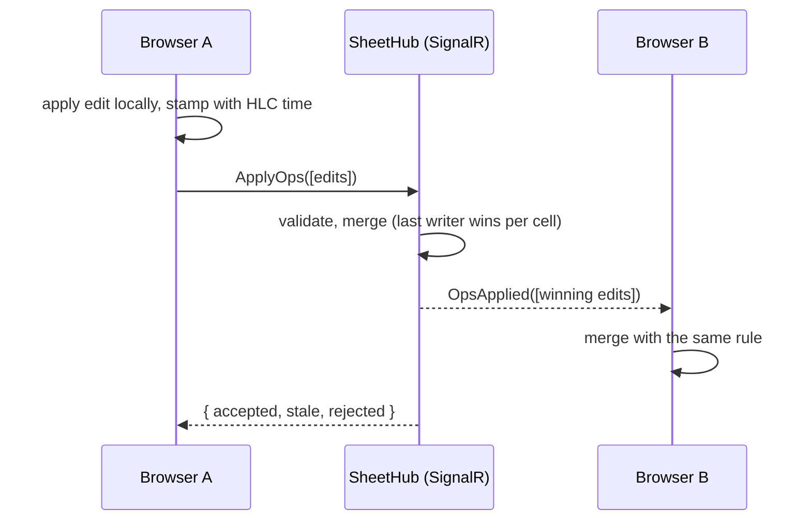

# GridSync

A spreadsheet where several people can edit the same sheet at once, one of them can drop offline, and when they reconnect every screen ends up identical, without a central lock or a server deciding who wins.

**Stack:** ASP.NET Core 10 and SignalR on the server, Angular 22 (standalone, zoneless, signals) in the browser.

This is phase 1 of 4: a live-synced, virtualized grid with presence and offline edit merging. Formulas, persistent offline storage, and row insertion come next (see [Roadmap](#roadmap)).

## Run it

You need the .NET 10 SDK and Node.js 22.22.3+ or 24.15+.

```bash
# terminal 1: the sync server on http://localhost:5080
cd server
dotnet run --project src/GridSync.Api

# terminal 2: the Angular app on http://localhost:4200 (proxies /hubs and /api to the server)
cd client
npm install
npm start
```

Open http://localhost:4200 in two browser windows side by side. Use `?sheet=anything` in the address bar to open a different sheet.

## Try this

1. Type in one window. The other window shows the edit a moment later, flashing in the author's color, with their cursor and name tag on the cell.
2. Paste a block of cells copied from Excel or Google Sheets. It arrives in the other window as one batch.
3. Press **Go offline** in window A. Edit a few cells in both windows, including the same cell in both. The status bar in A counts the edits waiting to sync.
4. Press **Go online**. A's queued edits reach B, B's edits reach A (and flash so you can see what changed while you were away), and the cell you edited in both windows shows the same value everywhere.
5. Press Ctrl+End. You're on row 100,000, and the page still only has about 30 rows in it.

## How it works



Every cell is a last-writer-wins register. Every edit carries a hybrid logical clock (HLC) timestamp, and the edit with the greater timestamp wins. That merge rule is commutative, associative, and idempotent, so any two replicas that have seen the same edits end up identical, no matter what order the edits arrived in or how many times they were delivered. The server, every browser, and the tests all use the same rule.

### Design decisions worth asking about

**Why a hybrid logical clock instead of wall-clock time?** If my laptop clock runs two minutes slow and I overwrite your edit after seeing it, wall-clock time says my edit is older and yours wins, which is the opposite of what I meant. An HLC folds in every timestamp it receives, so an edit made after seeing another edit always sorts after it, while staying close to real time. See `HybridLogicalClock.cs` and `hlc.ts` (same algorithm, same tie-break order).

**Why keep cleared cells as tombstones?** If clearing a cell deleted its entry, an offline replica still holding the old value would bring it back when it reconnects. A clear is stored as an edit whose value is null, and it wins or loses like any other edit.

**Why are retries safe?** Merges are idempotent: applying an edit twice changes nothing. So the client keeps unsent edits in a queue, resends them after a reconnect, and never needs to know whether a batch "half landed". The queue also coalesces: ten edits to the same cell while offline become one. And if you edit a cell again while its previous edit is in flight, the in-flight acknowledgment doesn't remove the newer edit (`pending.get(key) === op` in `sheet-sync.service.ts`).

**Why join the group before taking the snapshot?** A new client is added to the sheet's SignalR group first, then handed the snapshot. An edit landing in between may arrive twice (in the snapshot and as a broadcast), which is harmless. Doing it the other way round could lose it.

**Why is the server's merge lock-free?** `SheetState.Apply` uses a compare-and-swap loop on a `ConcurrentDictionary`: read the current value, decide, then `TryUpdate` only if nobody changed it in the meantime. Many hub calls can merge edits into the same sheet concurrently without a sheet-wide lock. A test hammers one cell from parallel threads to check the greatest timestamp always ends up in place.

**What does the server refuse to trust?** Clients can't stamp edits with timestamps more than 60 seconds in the future (otherwise a clock set to 2099 wins every conflict forever), can't use another replica's node id (which would let them win tie-breaks or disguise authorship), and are limited in batch size, value length, and number of sheets.

**Why a hand-written virtual scroller?** Only the rows on screen exist in the DOM. With fixed row heights, the visible range is pure arithmetic (`floor(scrollTop / rowHeight)`), the canvas height gives the scrollbar its true size, and one `translateY` slides the rendered window into place. Writing it by hand keeps the column headers and row numbers sticky on both axes and leaves room for column virtualization later.

## Tests

```bash
cd server && dotnet test         # 16 tests: HLC ordering, LWW merge, tombstones, validation,
                                 # a seeded convergence test (2,300 edits, 25 random delivery orders),
                                 # and a parallel-writers test for the lock-free merge
cd client && npm test            # 13 tests: the same properties on the TypeScript side
cd client && npm run smoke       # 14 end-to-end checks with real SignalR clients against a running server
```

`npm run smoke` needs the server running. Set `GRIDSYNC_URL=http://localhost:4200 GRIDSYNC_WS_ONLY=1` to run it through the Angular dev proxy over WebSockets only.

## Project layout

```
server/
  src/GridSync.Core/        HLC, LWW sheet state, op validation (no ASP.NET dependency)
  src/GridSync.Api/         SignalR hub, sheet store, presence tracking
  tests/GridSync.Core.Tests/
client/
  src/app/sync/             HLC, LWW map, SignalR sync service
  src/app/grid/             virtualized grid component
  scripts/smoke.mjs         end-to-end check against a live server
```

## Known limitations (phase 1)

- Server state lives in memory and resets on restart.
- Unsent edits also live in memory: closing a tab while offline loses them (the page warns you first).
- The app needs to reach the server once to load the sheet; it can go offline after that.
- Two people editing the same cell at the same moment keep one value, not a merge of both texts. That's the intended rule for spreadsheet cells.
- The grid has a fixed 100,000 by 26 size. Inserting rows concurrently is a harder problem, planned for phase 3.
- Browsers cap element height (around 17 million pixels in Firefox), so going far past 100,000 rows needs scaled scrolling.

## Roadmap

1. **Phase 1 (this):** live sync, presence, offline merge, virtualized grid.
2. **Phase 2:** a formula engine: parser, dependency graph between cells, incremental recalculation, cycle detection, evaluated in a Web Worker.
3. **Phase 3:** persistence (an append-only op log with periodic snapshots, EF Core), unsent edits stored in IndexedDB, and concurrent row insertion using fractional indexing. Property-based tests with FsCheck.
4. **Phase 4:** load testing with many simulated clients, Playwright end-to-end tests, and published numbers.
